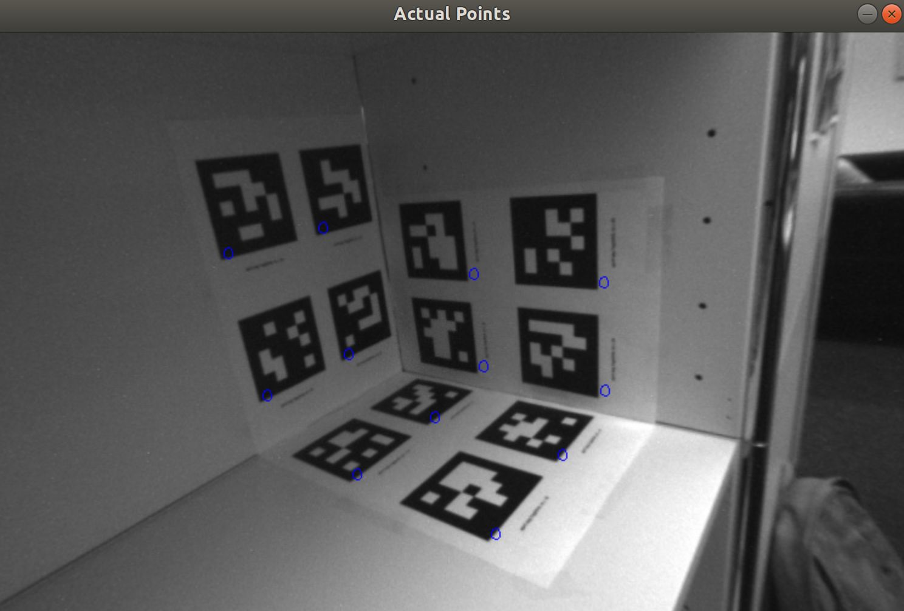
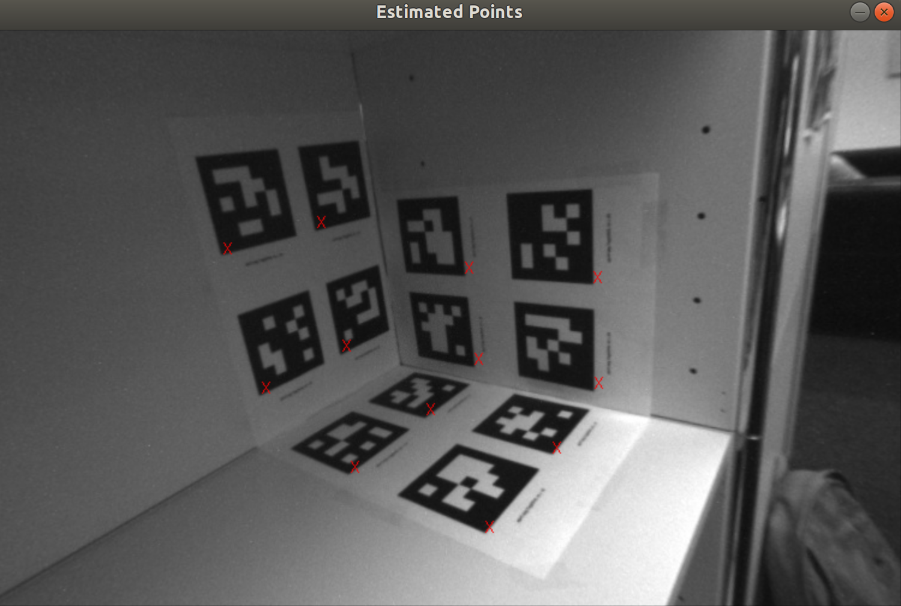
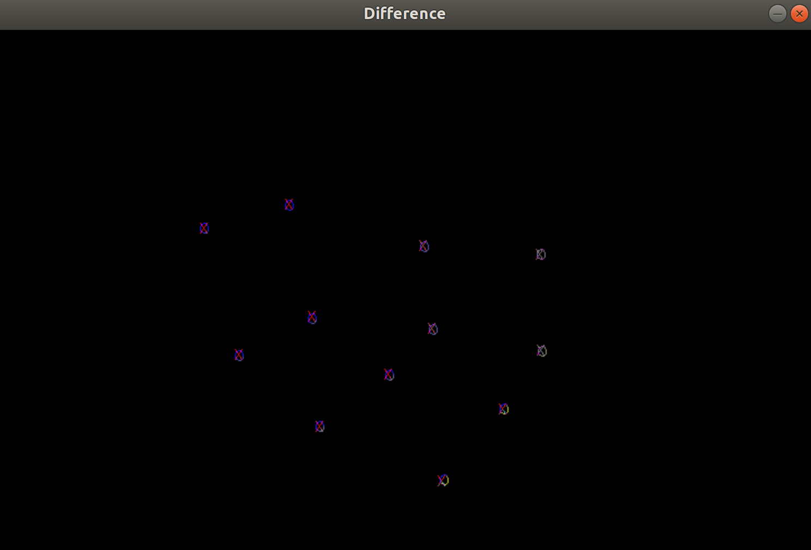

# p-n-p-problem

Implementation of the DLT algorithm to estimate the camera post [R|t] for each image using OpenCV, and Eigen in C++.

<figure>
 
 <figcaption>
 <p></p> 
 </figcaption>
</figure>


<figure>
 
 <figcaption>
 <p></p> 
 </figcaption>
</figure>


<figure>
 
 <figcaption>
 <p></p> 
 </figcaption>
</figure>


## Algorithm
```
1. Read an image In.
2. Read the 3d coods of the points in the world frame and corresponding  2d points in the image frame.
3. Fromulate matrix Q that contains the 2D-3D correspondances
4. Solve for matrix M that contains the pose of the camera.
5. Enforce that matrix R in M is orthogonal.
6. Recover the scale of projection M and recompute M.
```

## Dependencies

* `OpenCV `
* `CMake`
* `Eigen3.3`


## Run Instructions
```
mkdir build
cd build && cmake ..
make 
cd ../bin && ./main
```
To plot the camera trajectory from the extrinsics run
```
python3 traj.py
```
Dependencies for traj.py:  Python3,numpy and matplotlib

## References
```
1.http://rpg.ifi.uzh.ch/teaching.html
```

## Links
https://www.youtube.com/watch?v=TONyea7Yu_8&feature=youtu.be
